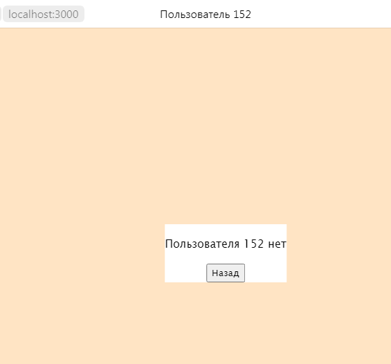

## Веб-приложение 


### Содержание
---
1. [Тестовое задание](#test-task)
2. [Работа приложения](#application)
3. [Как запустить веб-приложение?](#how-to-run-application)

### Тестовое задание <a name="test-task"></a>
Необходимо написать простое web-приложение с использованием node.js node-addon-api WinAPI для проверки наличия пользователя (например, Администратор) в списке пользователей операционной системы Windows.

Приложение должно работать по следующему сценарию

1. Пользователь запускает web-сервер из корня проекта:
   `server.bat`
2. Автоматически открывается браузер с начальной web страницей, на которой отображаются
- поле ввода имени пользователя
- кнопка "Проверить"
3. Пользователь вводит любое имя пользователя и нажимает на "проверить".
4. Если введённый пользователь присутствует в списке пользователей Windows, отображается 
страница с надписью "Пользователь <имя_введённого_пользователя> есть", 
иначе "Пользователя <имя_введённого_пользователя> нет". 
Под надписью есть кнопка "Назад", при нажатии на которую происходит возврат на начальную страницу.
5. Проверку наличия введённого имени пользователя в списке пользователей ОС Windows запрещено проводить путём сравнения текущего пользователя, от которого запущен процесс сервера и введённого пользователя, а также запрещено использовать названия домашних каталогов пользователей в каталоге C:\Users (С:\Пользователи).

Список пользователей для проверки можно получить через Управление компьютером->Служебные программы->Локальные пользователи и группы->Пользователи.

6. В корне проекта создать файл README.MD с текстом тестового задания в кодировке UTF-8

### Работа приложения <a name="application"></a>
_**Введенное имя пользователя найдено в списке пользователей Windows**_


**_Введенное имя пользователя не найдено в списке пользователей Windows_**



**_Имя пользователя не было введено_**


### Как запустить веб-приложение? <a name="how-to-run-application"></a>
1. Установить **_Node.js_** на компьютер.
Чтобы убедиться в том, что `Node.js` работает, необходимо 
выполнить следующие команды (в командной строке):
```
node -v  # Проверяем версию Node.js  

npm -v   # Проверяем наличие npm
```
2. Запустить BAT-файл (`server.bat`).
3. Приложение должно быть запущено! Если возникли проблемы с зависимостями
   (например, _**express**_, _**iconv-lite**_), установите их.  
